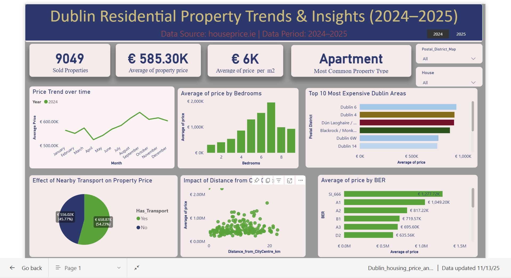

# HOUSING-PRICE-ANALSIS-IN-IRELAND
# 🏠 Dublin Property Market Analysis (2024–2025)

### 📊 Overview
This project explores residential property sales data in Dublin (2024–2025) to uncover patterns in house prices and the factors influencing them.  
The goal was to analyze and visualize how aspects like location, property type, BER rating, size, and proximity to transport impact market prices — providing valuable insights for real estate agents, investors, and buyers.

### 🎯 Business Problem
How can real estate agencies or investors accurately analyze property prices in Dublin to make smarter buying and selling decisions?

### 🧠 Objective
- Analyze property price variations across Dublin.
- Compare prices by area, property type, and BER rating.
- Explore the impact of distance from city centre** and public transport proximity**.
- Build a clean dataset ready for visualization and modeling.

### 💾 Data Source
Data was scraped from [houseprice.ie](https://houseprice.ie) using Python and enriched with:
- Geolocation data(via Nominatim API)
- Transport proximity info (via Overpass API)
- Socio-economic features like BER rating, bedrooms, and property type.

### 🛠️ Tools & Technologies
- Python(BeautifulSoup, pandas, geopy, regex, requests)
- Power BIfor interactive dashboard visualization
- Excel for initial exploration and quick checks
- GitHub + VS Code for version control and collaboration

### 📈 Dashboard Insights (Power BI)
Key visuals in the Power BI dashboard:
- Average property price by Dublin postal district
- Price trend over months and years
- Analysis by property type and BER rating
- Distance from city centre vs. price correlation
- Average property price by no of  Bedrooms

### 🧹 Data Processing Steps
1. Web scraping property listings from 2024–2025.  
2. Geocoding each area to find distance from Dublin city centre.  
3. Transport proximity check (DART/Luas stations within 1 km).  
4. Data cleaning & feature engineering**:
   - Convert price and floor area to numeric
   - Extract sale year/month
   - Add `price_per_m2`, `Has_Transport`, etc.  
5. Export final cleaned dataset:  
   `dublin_cleaned_final.csv`

### 📊 Business Value
- Helps real estate agencies set competitive property prices  
- Enables investors and buyers to make data-driven decisions
- Provides a foundation for future predictive modeling (price prediction)

### 🔗 Dashboard Preview
!
